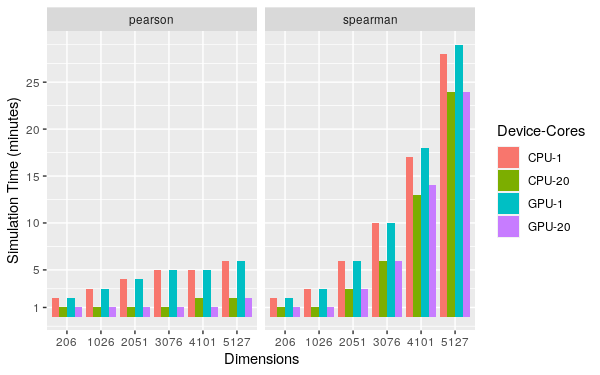

# Monte Carlo evaluations {#simulations}

```{r ch040-LoadLib040, echo = FALSE, eval = FALSE, message=FALSE, warning=FALSE, results = "hide"}
## devtools::install_github("SchisslerGroup/bigsimr", ref="dev-julia")
library(bigsimr)
Sys.setenv(JULIA_NUM_THREADS=parallel::detectCores())
## Either let JuliaCall find your installation of Julia or set manually
bs <- bigsimr_setup(JULIA_HOME = "/usr/local/bin/")
dist <- distributions_setup() # Julia distributions
library(tidyverse)
cores <- as.integer( parallel::detectCores() - 1 )
## cores <- as.integer( 1 )
set.seed(10162020)
```

```{r ch040-preview, echo = FALSE, eval = FALSE}
bookdown::preview_chapter('040-monte-carlo-evaluation.Rmd')
```

Before applying our methodology to real data simulation, we conduct several Monte Carlo studies to investigate method performance.
Since marginal parameter matching in our scheme is essentially a sequence of univariate inverse probability transforms, the challenging aspects are the accuracy of dependency matching and computational efficiency at high dimensions.
To evaluate our methods in those respects, we design the following numerical experiments to first assess accuracy of matching dependency parameters in bivariate simulations and then time the procedure in increasingly large dimension $d$.

## Bivariate experiments

We select bivariate simulation configurations to ultimately simulate our motivating discrete-valued RNA-seq example, and, so we proceed in increasing complexity, leading to the model in our motivating application in Section \@ref(examples). 
We begin with empirically evaluating the dependency matching across all three supported correlations --- Pearson's, Spearman's, and Kendall's --- in identical, bivariate marginal configurations.
For each pair of identical margins, we vary the target correlation across $\Omega$, the set of possible admissible values for correlation type, to evaluate the simulation's ability to obtain the theoretic bounds. 
The simulations progress from bivariate normal, to bivariate gamma (non-normal yet continuous), and bivariate negative binomial (mimicking RNA-seq counts).

```{r ch040-biNormal, echo = FALSE, eval = TRUE}
mu <- 0
sigma <- 1
if ( !file.exists( 'results/biNorm_sims.rds' ) )  {
    mom_norm <- function(x) {
        m <- mean(x)
        s <- sd(x)
        list(mean = m, sd = s)
    }
    mu <- 0
    sigma <- 1
    margins <- alist(
        qnorm(mean = mu, sd = sigma),
        qnorm(mean = mu, sd = sigma)
    )
    type <- c("pearson", "spearman", "kendall")
    cores <- as.integer( parallel::detectCores() - 1 )
    n <- c(1e3, 1e4, 1e5)
    ## n <- c(1e1, 1e2, 1e3)
    adjustForDiscrete <- c(FALSE)
    eps <- 1e-2
    grid_steps <- 100
    ## grid_steps <- 10
    sim_pars <- expand.grid(type = type, cores = cores, n = n,
                            stringsAsFactors = FALSE,
                            adjustForDiscrete = adjustForDiscrete)
    res <- data.frame()
    dir.create("./results/biNorm_sims", showWarnings = TRUE, recursive = TRUE)
    for (i in 1:nrow(sim_pars)) {
        type <- sim_pars$type[i]
        cores <- sim_pars$cores[i]
        n <- sim_pars$n[i]
        adjustForDiscrete <- sim_pars$adjustForDiscrete[i]
        tmp_bounds <- cor_bounds(margins, method = type)
        cor_lo <- tmp_bounds$lower[1,2] + eps
        cor_hi <- tmp_bounds$upper[1,2] - eps
        cor_seq <- seq(cor_lo, cor_hi, length.out = grid_steps)
        ## rho = cor_seq[1]
        for (rho in cor_seq) {
            Rho <- matrix(rho, 2, 2)
            diag(Rho) <- 1.0
            ## Rho <- convertCor( rho = Rho, from = type, to = 'pearson' )
            time_data <- system.time({
                ## x <- rmvn(n = n, mu = rep( mu, 2 ), sigma = Rho)
                ## use rvec to test our software
                x <- rvec(n = n,
                          rho = Rho,
                          margins = margins,
                          type = type,
                          cores = cores)
            })
            ## Save the sims in case
            id <- paste0(
                "d", 2,
                "-N", n,
                "-c", cores,
                "-r", rho,
                "-Cor", type,
                "-adj", as.character(adjustForDiscrete),
                "-dev", "1CORE",
                "-lib", "bigsimr"
            )
            ## save sims in their own subdirectory
            saveRDS(x, file = paste0("./results/biNorm_sims/", id, ".rds"))
            ## Estimate statistics
            Rho_hat <- cor_fast(x, method = type)
            rho_hat <- Rho_hat[1, 2]
            norm_args_hat <- mom_norm(x[,1])
            mu_hat <- norm_args_hat$mean
            sigma_hat <- norm_args_hat$sd
            ## Save the results
            res <- rbind(res, data.frame(
                                  method = "bigsimr",
                                  device = "CPU",
                                  type = type,
                                  cores = cores,
                                  margins = "norm",
                                  adjustForDiscrete = adjustForDiscrete,
                                  d = 2,
                                  N = n,
                                  rho = rho,
                                  rho_hat = rho_hat,
                                  mean = mu,
                                  sd = sigma,
                                  mean_hat = mu_hat,
                                  sd_hat = sigma_hat,
                                  sim_time = unname(time_data["elapsed"])
                              ))
        }
    }
    res$type <- factor(res$type, levels = c("pearson",  "spearman", "kendall" ) )
    saveRDS(object = res, "./results/biNorm_sims.rds")
}
```


```{r ch040-biGamma, echo = FALSE, eval = TRUE}
shape <- 10
rate <- 1
if ( !file.exists( 'results/biGamma_sims.rds' ) )  {
    mom_gamma <- function(x) {
        m <- mean(x)
        s <- sd(x)
        list(shape = m^2 / s^2, rate = m / s^2)
    }
    margins <- alist(
        qgamma(shape = shape, rate = rate),
        qgamma(shape = shape, rate = rate)
    )

    type <- c("pearson", "spearman", "kendall")
    ## cores <- c(1L)
    cores <- as.integer( parallel::detectCores() - 1 )
    n <- c(1e3, 1e4, 1e5)
    ## n <- c(1e1, 1e2, 1e3)
    adjustForDiscrete <- c(FALSE)

    eps <- 1e-2
    grid_steps <- 100
    ## grid_steps <- 10
    sim_pars <- expand.grid(type = type, cores = cores, n = n,
                            stringsAsFactors = FALSE,
                            adjustForDiscrete = adjustForDiscrete)


    dir.create("./results/biGamma_sims", showWarnings = TRUE, recursive = TRUE)
    res <- data.frame()
    for (i in 1:nrow(sim_pars)) {
        
        type <- sim_pars$type[i]
        cores <- sim_pars$cores[i]
        n <- sim_pars$n[i]
        adjustForDiscrete <- sim_pars$adjustForDiscrete[i]

        tmp_bounds <- cor_bounds(margins, method = type)
        cor_lo <- tmp_bounds$lower[1,2] + eps
        cor_hi <- tmp_bounds$upper[1,2] - eps
        cor_seq <- seq(cor_lo, cor_hi, length.out = grid_steps)

        ## rho = cor_seq[1]
        for (rho in cor_seq) {
            Rho <- matrix(rho, 2, 2)
            diag(Rho) <- 1.0

            time_data <- system.time({
                x <- rvec(n = n,
                          rho = Rho,
                          margins = margins,
                          cores = cores,
                          type = type,
                          ensure_PSD = TRUE)
            })

            ## Save the sims in case
            id <- paste0(
                "d", 2,
                "-N", n,
                "-c", cores,
                "-r", rho,
                "-Cor", type,
                "-adj", as.character(adjustForDiscrete),
                "-dev", "CPU",
                "-lib", "bigsimr"
            )
            saveRDS(x, file = paste0("./results/biGamma_sims/", id, ".rds"))

            ## Estimate statistics
            Rho_hat <- cor_fast(x, method = type)
            rho_hat <- Rho_hat[1, 2]
            gamma_args_hat <- mom_gamma(x[,1])
            shape_hat <- gamma_args_hat$shape
            rate_hat <- gamma_args_hat$rate

            ## Save the results
            res <- rbind(res, data.frame(
                                  method = "bigsimr",
                                  device = "CPU",
                                  type = type,
                                  cores = cores,
                                  margins = "gamma",
                                  adjustForDiscrete = adjustForDiscrete,
                                  d = 2,
                                  N = n,
                                  rho = rho,
                                  rho_hat = rho_hat,
                                  shape = shape,
                                  rate = rate,
                                  shape_hat = shape_hat,
                                  rate_hat = rate_hat,
                                  sim_time = unname(time_data["elapsed"])
                              ))
        }
    }
    res$type <- factor(res$type, levels = c("pearson",  "spearman", "kendall" ) )
    saveRDS(object = res, "./results/biGamma_sims.rds")
}
```

```{r ch040-biNegBin, echo = FALSE, eval = TRUE}
size <- 4
prob <- 3e-04
if ( !file.exists( 'results/biNB_sims.rds' ) )  {
    mom_nbinom <- function(x) {
        m <- mean(x)
        s <- sd(x)
        list(size = m^2 / (s^2 - m), prob = m / s^2)
    }

    margins <- alist(
        qnbinom(size = size, prob = prob),
        qnbinom(size = size, prob = prob)
    )

    type <- c("pearson", "spearman", "kendall")
    cores <- as.integer( parallel::detectCores() - 1 )
    ## cores <- cores
    n <- c(1e3, 1e4, 1e5)
    ## n <- c(1e1, 1e2, 1e3)
    adjustForDiscrete <- c(FALSE)

    eps <- 1e-2
    grid_steps <- 100
    ## grid_steps <- 10
    sim_pars <- expand.grid(type = type, cores = cores, n = n,
                            stringsAsFactors = FALSE,
                            adjustForDiscrete = adjustForDiscrete)

    dir.create("./results/biNB_sims", showWarnings = TRUE, recursive = TRUE)
    res <- data.frame()
    for (i in 1:nrow(sim_pars)) {
        type <- sim_pars$type[i]
        cores <- sim_pars$cores[i]
        n <- sim_pars$n[i]
        adjustForDiscrete <- sim_pars$adjustForDiscrete[i]
        ## AGS. 17 Oct 2020. cor_bounds failed.
        ## I'll create a minimal working example and open an issue
        ## work around for now
        if ( type == 'pearson' ) {
            tmp_bounds <- cor_bounds(margins, method = type)
            cor_lo <- tmp_bounds$lower[1,2] + eps
            cor_hi <- tmp_bounds$upper[1,2] - eps
        } else {
            cor_lo <- -1 + eps
            cor_hi <- 1 - eps
        }
        cor_seq <- seq(cor_lo, cor_hi, length.out = grid_steps)

        for (rho in cor_seq) {
            Rho <- matrix(rho, 2, 2)
            diag(Rho) <- 1.0

            time_data <- system.time({
                x <- rvec(n = n,
                          rho = Rho,
                          margins = margins,
                          cores = cores,
                          type = type,
                          ensure_PSD = TRUE)
            })

            ## Save the sims in case
            id <- paste0(
                "d", 2,
                "-N", n,
                "-c", cores,
                "-r", rho,
                "-Cor", type,
                "-adj", as.character(adjustForDiscrete),
                "-dev", "CPU",
                "-lib", "bigsimr"
            )
            saveRDS(x, file = paste0("./results/biNB_sims/", id, ".rds"))

            ## Estimate statistics
            Rho_hat <- cor_fast(x, method = type)
            rho_hat <- Rho_hat[1, 2]
            nbinom_args_hat <- mom_nbinom(x[,1])
            size_hat <- nbinom_args_hat$size
            prob_hat <- nbinom_args_hat$prob

            ## Save the results
            res <- rbind(res, data.frame(
                                  method = "bigsimr",
                                  device = "CPU",
                                  type = type,
                                  cores = cores,
                                  margins = "nbinom",
                                  adjustForDiscrete = adjustForDiscrete,
                                  d = 2,
                                  N = n,
                                  rho = rho,
                                  rho_hat = rho_hat,
                                  size = size,
                                  prob = prob,
                                  size_hat = size_hat,
                                  prob_hat = prob_hat,
                                  sim_time = unname(time_data["elapsed"])
                              ))
        }
    }
    res$type <- factor(res$type, levels = c("pearson",  "spearman", "kendall" ) )
    saveRDS(object = res, "./results/biNB_sims.rds")
}
```

Table \@ref(tab:sims) lists our identical-marginal, bivariate simulation configurations.
We increase the simulate replicates $B$ to check that our results converge to the target correlations and gauge statistical efficiency.
We select distributions beginning with a standard multivariate normal (MVN) as we expect the performance to be exact (up to MC error) for all correlation types.
Then, we select a non-symmetric continuous distribution: a standard (rate =1) two-component multivariate gamma (MVG).
Finally, we select distributions and marginal parameter values that are motivated by our RNA-seq data, namely values proximal to probabilities and sizes estimated from the data (see [Example applications](examples) for estimation details).
Thus we arrive at a multivariate negative binomial (MVNB) $p_1 = p_2 = `r prob`, r_1 = r_2 = 4,\rho \in \Omega$.

Table: (\#tab:sims) Identical margin, bivariate simulation configurations to evaluate correlation matching accuracy and efficiency.

| Simulation Reps ($B$) | Correlation Types | Identical-margin 2D distribution |
|-------------|:--------------:|----------------------:|
|$1000$ | Pearson ($\rho_P$) | ${ \bf Y} \sim MVN( \mu= 0 , \sigma = 1, \rho_i ), i=1,\ldots,100$ |
|$10,000$ | Spearman ($\rho_S$) | ${ \bf Y} \sim MVG( shape = 10, rate = 1, \rho_i ), i=1,\ldots,100$ |
| $100,000$| Kendall ($\tau$)| ${ \bf Y} \sim MVNB(p = `r prob`, r = 4,\rho_i), i=1,\ldots,100$ |

For each of the unique 9 simulation configurations described above, we estimate the correlation bounds and vary the correlations along a sequence of 100 points evenly placed within the bounds, aiming to explore $\Omega$.
Specifically, we set correlations $\{ \rho_1 = ( \hat{l} + \epsilon), \rho_2 = (\hat{l} + \epsilon) + \delta, \ldots, \rho_{100} = (\hat{u} - \epsilon) \}$, with $\hat{l}$ and $\hat{u}$ being the estimated lower and upper bounds, respectively, and increment value $\delta$.
The adjustment factor, $\epsilon=0.01$, is introduced to handle numeric issues when the bound is specified exactly.

<!-- 
*Bivariate Normal*.
Let's simulate a bivariate normal and check our correlation matching performance as N increases.
Standard bivariate normal 
Here we have BVN( $\mu_1 = \mu_2 = 0, \rho_{type}$ ).
We vary $\rho$ across the entire possible range of correlations for each correlation type.
Figure \@ref(fig:ch040-biNormPlot) `bigsimr` recovers the Pearson specified correlations for MVN.

*Bivariate Gamma*. 
Similarly, let's check the performance for a non-symmetric continuous distribution: a standard (rate =1) bivariate gamma.
Here we have a Bivariate Gamma with $shape_1 = shape_2 = 10, \rho_{type}$.
We vary $\rho$ across the entire possible range of correlations for each correlation type.
Figure \@ref(fig:ch040-biGammaPlot) `bigsimr` recovers the Pearson specified correlations for bivariate gamma.
*Bivariate Negative Binomial*. 
Figure \@ref(fig:ch040-biNegBinPlot) `bigsimr` recovers the Pearson specified correlations for bivariate negative binomial.

 -->

```{r ch040-biNormPlot, echo = FALSE, eval = FALSE, message=FALSE, warning=FALSE, fig.height = 5, fig.width= 8, fig.align='center', fig.cap = "`bigsimr` recovers the Pearson specified correlations for MVN."}
dat <- readRDS("./results/biNorm_sims.rds")
dat %>%
    filter(cores == cores) %>%
    ggplot(aes(rho, rho_hat, color = type)) +
    ## ggplot(aes(rho, rho_hat)) +
    geom_point() +
    geom_abline(slope = 1) +
    ## facet_wrap(~ + N) + theme_bw()
    facet_wrap(~ type + N) + theme_bw()
## ggsave('fig/plot-biNormPlot.pdf')
```

```{r ch040-biGammaPlot, echo = FALSE, eval = FALSE, message=FALSE, warning=FALSE, fig.height = 5, fig.width= 8, fig.align='center', fig.cap = "`bigsimr` recovers the Pearson specified correlations for Bivariate Gamma."}
dat <- readRDS("./results/biGamma_sims.rds")
dat %>%
    filter(cores == cores) %>%
    ggplot(aes(rho, rho_hat, color = type)) +
    ## ggplot(aes(rho, rho_hat)) +
    geom_point() +
    geom_abline(slope = 1) +
    ## facet_wrap(~ + N) + theme_bw()
    facet_wrap(~ type + N) + theme_bw()
## ggsave('fig/plot-biGammaPlot.pdf')
```


```{r ch040-biNegBinPlot, echo = FALSE, eval = FALSE, message=FALSE, warning=FALSE, fig.path='fig/plot-', dev='png', fig.ext='png', fig.align='center', fig.width = 8, fig.height=5,fig.cap = "`bigsimr` recovers the correlations for bivariate negative binomial only approximately for Pearson but (nearly) exactly for the rank-based correlations."}
dat <- readRDS("./results/biNB_sims.rds")
dat %>%
    filter(cores == cores) %>%
    ggplot(aes(rho, rho_hat, color = type)) +
    ## ggplot(aes(rho, rho_hat)) +
    geom_point() +
    geom_abline(slope = 1) +
    ## facet_wrap(~ + N) + theme_bw()
    facet_wrap(~ type + N) + theme_bw()
## ggsave('fig/plot-biNegBinPlot.pdf')
```

```{r ch040-combineBiSims, cache=F}
## compare relative differences in MSE for each dependency, compared to Pearson
allDat <- NULL
dat <- readRDS("./results/biNorm_sims.rds") %>% select( margins, type, N, rho, rho_hat  ) 
allDat <- rbind( allDat, dat )
dat <- readRDS("./results/biGamma_sims.rds") %>% select( margins, type, N, rho, rho_hat  )
allDat <- rbind( allDat, dat )
dat <- readRDS("./results/biNB_sims.rds") %>% select( margins, type, N, rho, rho_hat  )
allDat <- rbind( allDat, dat )
allDat$margins <- factor(allDat$margins, levels = c( 'norm', 'gamma', 'nbinom'),
                         labels = c( 'MVN', 'MVG', 'MVNB' ) )
allDat$type <- factor(allDat$type, levels = c( 'pearson', 'spearman', 'kendall' ),
                      labels = c( 'Pearson', 'Spearman', 'Kendall' ) )
allDat$N <- factor(allDat$N, levels = c( 1000, 10000, 100000) )
```

Figure \@ref(fig:ch040-bPlot) displays the aggregated bivariate simulation results.
Table \@ref(tab:ch040-BiError) contains the mean absolute error (MAE) in reproducing the desired dependency measures for the three bivariate scenarios.

```{r ch040-BiError, echo = FALSE, eval=TRUE, message=FALSE, warning=FALSE}
## tabMSE  <- allDat %>%
##    group_by( N, margins ) %>%
##    summarize( mse = mean( ( rho - rho_hat )^2 ) )
tabMAE  <- allDat %>%
    ## filter( N == 100000) %>%
    group_by( N, type, margins ) %>%
##     summarize( mse = mean( ( rho - rho_hat )^2 ) ) %>%
    summarize( MAE = mean( abs( rho - rho_hat )  ) )
## normMSE <- as.numeric( tabMSE[ tabMSE$margins == 'norm', 'mse' ] ) 
## ( tabMSE$mse - normMSE ) / normMSE
## ( tabMSE$mse - as.numeric( tabMSE[ tabMSE$margins == 'norm', 'mse' ]) )
## ( tabMSE$mse - as.numeric( tabMSE[ tabMSE$margins == 'norm', 'mse' ]) ) / tabMSE$mse

## AGS 12/22/20: Removing the latex formatting fixes the html render.
## But how to improve latex table formatting? Better to use the template
knitr::kable(tabMAE,
             ## format = 'latex',
             col.names = c("No. of random vectors",
                           "Correlation type",
                           "Distribution",
                           "Mean abs. error"),
             ## booktabs = TRUE,
             caption = 'Average abolute error in matching the target dependency across the entire range of possible correlations for each bivariate marginal.',
             ## linesep = c('', '',  '\\addlinespace')
)
```


Overall, the studies show that our methodology is generally accurate across the entire range of possible correlation values for the rank-based dependency measures, at least in these limited simulation settings for the rank-based correlations.
For the two non-normal bivariate marginals, the Pearson correlation matching is approximate.
For discrete margins, matching the dependency measures was somewhat less accurate, even for the rank-based metrics, and particularly inaccurate near the lower bound of Pearson correlations.

```{r ch040-bPlot, cache=F, echo = FALSE, eval = TRUE, message=FALSE, warning=FALSE, fig.asp = 1.30, fig.weight = 4, fig.align='center', fig.cap = "Bivariate simulations match specified correlations. The horizontal axis plots the specified target correlations across the entire range of possible correlations for each bivariate margin. Normal margins are plotted in dark blue, gamma in medium blue, and negative binomial in light blue. As the number of simulated vectors $B$ increases from left to right, the variation in estimated correlations (vertical axis) decreases. The dashed line indicates equality between the specified and estimated correlations. Only the normal margins match the Pearson correlations (top row) exactly across the entire range of correlations. The two non-normal bivariate random vectors experience attenuation (downward bias) for extreme Pearson correlations (due to limitations in our algorithm) and more restriction (due to the Frechet bounds). The rank-based correlations (bottom two rows) are matched exactly for all margins and obtain the full range of possible dependencies."}
# https://www.datanovia.com/en/blog/how-to-change-ggplot-facet-labels/
# New facet label names
repsLabs <- paste0("B=", c("1,000", "10,000", "100,000") )
names(repsLabs) <- c(1000, 10000, 100000)
typeLabs <- c( 'Pearson', 'Spearman', 'Kendall' )
names(typeLabs) <- c( 'Pearson', 'Spearman', 'Kendall' )

# Set colors
## RColorBrewer::display.brewer.all()
numColors <- 4
numGroups <- length(levels(allDat$margins))
## myColors <- rev( RColorBrewer::brewer.pal(n = numColors, name = 'Greys')[ ((numColors - numGroups) + 1): numColors  ] )
myColors <- rev( RColorBrewer::brewer.pal(n = numColors, name = 'Blues')[ ((numColors - numGroups) + 1): numColors  ] )

allDat %>%
    ## ggplot(aes(x = rho, y = rho_hat, color = margins, shape = margins)) +
    ggplot(aes(x = rho, y = rho_hat, color = margins)) +
    ## ggplot(aes(rho, rho_hat)) +
    ## geom_point(alpha = 1, size = 2) +
    geom_point(size = 2) +
    ## scale_shape_manual(values=c(1, 2, 3))+
    ## scale_color_manual(values=c('#999999','#E69F00', '#56B4E9')) +
    scale_color_manual(values = myColors ) +
    geom_abline(slope = 1, linetype = 'dashed') +
    labs(x = "Specified Correlation", y = "Estimated Correlation") +
    ## facet_wrap(~ + N) + theme_bw()
    facet_wrap(~ type + N, labeller = labeller(N = repsLabs, type = typeLabs)) +
    theme_bw() +
    theme(legend.position = "bottom", legend.direction = "horizontal")

## allDat %>%
##     ggplot(aes(x = rho, y = rho_hat, color = type, shape = type)) +
##     ## ggplot(aes(rho, rho_hat)) +
##     geom_point(alpha = 0.75) +
##     geom_abline(slope = 1) +
##     labs(x = "Specified Correlation", y = "Estimated Correlation") + 
##     ## facet_wrap(~ + N) + theme_bw()
##     facet_wrap(~ margins + N) + theme_bw()
 
## ggsave('fig/plot-biNormPlot.pdf')
```

The accuracy appears adequate for many applications.
In practice, we recommend evaluating the accuracy in each application setting, using methods similar to those presented above.

<!-- 
See [Discussion](discussion) for future directions for fast Pearson matching and discrete-specific modifications.
your comment -->

## Scale up to High Dimensions

With information of our method's accuracy from a low-dimensional perspective, we now turn to assessing whether the `bigsimr` can scale to larger dimensional problems. 
Specifically, we seek evidence to determine whether the method can scale to higher dimensions in a practical time.
Using our motivating RNA-seq data, we filtered the original 20,501 genes to the high-expressing genes at increasing percentiles, $1, 5, 10, 15, 20, 25\%$, to obtain $d=\{206, 1026, 2051, 3076, 4101, 5127\}$ marginals and $\binom{d}{2}$ pairwise correlations at each setting.
For example, for $d=5127$ there are $13,140,501$ correlation coefficients.
We estimated the marginal negative binomial parameters and the correlation coefficients from the RNA-seq data to seed our simulations.
(See [Example applications](examples) for a detailed description of the estimation).

Figure \@ref(fig:ch040-gpuVScpuFig) displays computation times using various high-performance settings (1 central processing unit, CPU-1, versus twenty CPUs, CPU-20; with and without GPU acceleration, GPU-1; GPU-20) to produce $B=10,000$ random vectors.
The Pearson simulations are much faster since the correlation conversion steps are avoided (pre-processing step; see [Algorithms](algorithms)), but as we know from above the accuracy will suffer slightly, especially near the negative boundary of the possible correlations.
Matching Spearman's correlation at larger $d$ becomes costly if one desires to produce $B=10,000$ random vectors at many different simulation settings, but the conversion steps need only be computed once (see [MC evaluation of correlation estimation efficiency](MC-evaluation-of-correlation-estimation-efficiency) for an example of this strategy).

```{r ch040-gpuVScpuFig, echo=F, out.width='80%', fig.align='center', fig.cap="Computation times as d increases. We filter to the top 1, 5, 10, 15, 20, 25\\% expressing genes (in terms of median expression.)"}

```

*Limitations, conclusions, and recommendations.*
In the bivariate studies, we chose arbitrary simulation parameters for three distributions, moving from the Gaussian to the discrete and non-normal, multivariate negative binomial.
Under these conditions, the simulated random vectors sample the desired bivariate distribution across the entire range of pairwise correlations for the three dependency measures.
The simulation results could differ for other choices of simulation settings.
Specifying extreme correlations near the boundary or Frechet bounds could result in poor simulation performance.
Fortunately, it is straightforward to evaluate simulation performance by using strategies similar to those completed above.
We expect our random vector generation to perform well for the vast majority of NORTA-feasible correlation matrices, but advise to check the performance before making inferences/further analyses.
