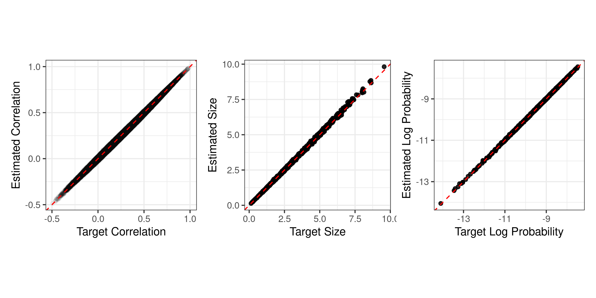

# RNA-seq data applications  {#examples}


```{r ch050-LoadLib, include=FALSE, cache=FALSE}
devtools::load_all()
library(tidyverse)
library(patchwork)
library(bigsimr)

Sys.setenv(JULIA_NUM_THREADS = parallel::detectCores())
bs <- bigsimr_setup(pkg_check = FALSE)
dist <- distributions_setup()

cores <- as.integer(parallel::detectCores() - 1)
set.seed(10142020)
```


This section demonstrates how to simulate multivariate data using `bigsimr`, aiming to replicate the structure of high-dimensional dependent count data. In an illustration of our proposed methodology, we seek to simulate RNA-sequencing data by producing simulated random vectors mimicking the observed data and its generating process. Modeling RNA-seq using multivariate probability distributions is natural as inter-gene correlation is an inherent part of biological processes [@Wang2009b]. Yet many models do not account for this, leading to major disruptions to the operating characteristics of statistical estimation, testing, and prediction. See @Efron2012 for a detailed discussion with related methods and @Wu2012b, @Schissler2018, @Schissler2019 for applied examples. The following subsections apply `bigsimr`'s methods to real RNA-seq data, including replicating an estimated parametric structure, MC probability estimation, and MC evaluation of correlation estimation efficiency.

## Simulating High-Dimensional RNA-seq data


```{r ch050-readBRCA, cache=FALSE}
d <- 1000
brca1000 <- example_brca %>%
  select(all_of(1:d)) %>%
  mutate(across(everything(), as.double))
```


We begin by estimating the structure of the TCGA BRCA RNA-seq data set (see [Background](background)). Ultimately, we will simulate $B=10,000$ random vectors ${\bf Y}=(Y_1, \ldots, Y_d)^\top$ with $d=`r d`$. We assume a multivariate negative binomial (MVNB) model as RNA-seq counts are often over-dispersed and correlated. All $d$ selected genes exhibit over-dispersion (data not shown) and, so, we proceed to estimate the NB parameters $(r_i, p_i), i=1,\ldots,d$ to determine the target marginal PMFs $f_i$. To complete specification of the simulation algorithm inputs, we estimate the Spearman correlation matrix ${ \bf R}_{Spearman}$ to characterize dependency.


<!--
This suggests simulating high-dimensional multivariate NB (MVB) with heterogeneous marginals would be useful tool in the development and evaluation of RNA-seq analytics. This procedure results in count data with infinite support, since RNA-sequencing platforms measure gene expression by enumerating the number of reads aligned to genomic regions. All these genes exhibit over-dispersion and, so, we proceed to estimate the NB parameters $(r_i, p_i), i=1,\ldots,d$ to determine the target marginal PMFs $g_i(y_i)$ (via method of moments). Notably, the $\hat{p}_i's$ are small --- ranging in $[3.934 \times 10^{-6} , 1.217 \times 10^{-2}]$. To complete the simulation algorithm inputs, we estimate the Pearson correlation matrix $\bf{R_Y}$ and set that as the target correlation.
-->


<!--
With the simulation targets specified, we proceed to simulate $N=10,000$ random vectors $\bf{Y}$ $=( Y_1,\ldots,Y_d)$ with target Pearson correlation $\bf{R_Y}$ and marginal PMFs $g_i(y_i)$ using a $\bf{T}$-Poisson hierarchy of Kind II. Specifically, we first employ the \emph{direct Gaussian copula} approach to generate $N$ random vectors following a standard multivariate Gamma distribution $\bf{T}$ with shape parameters $r_i$ equal to the target $n_i$ and Pearson correlation matrix $\bf{R_T}$. Care must be taken when setting the specifying $\bf{R}$ (refer to Equation \ref{gay.cop.pdf}) --- we employ Equation \ref{mix.poi.corr} to compute the scaling factors $c_{i,j}$ and adjust the underlying correlations to ultimately match the target $\bf{R_Y}$. Notably, of the $525,825$ pairwise correlations from the $1026$ genes, no scale factor was less than $0.9907$, indicating the model can produce essentially the entire range of possible correlations. Here we are satisfied with approximate matching of the specified Gamma correlation and set $\bf{R}$ = $\bf{R_T}$ in our Gaussian copula scheme ($\bf{R}$ indicating the specified multivariate Gaussian correlation matrix). Finally, we generate the desired random vector $Y_i=N_i(t_i)$ by simulating Poisson counts with expected value $\mu_i=\lambda_i \times T_i$, for $i=1,\ldots,d$ (with $\lambda_i=\frac{(1-p_i)}{p_i}$) and repeat $N=10,000$ times.
-->


With this goal in mind, we first estimate the desired correlation matrix using the fast implementation provided by `bigsimr`:


```{r ch050-estRhoBRCA, echo=TRUE, cache=FALSE}
# Estimate Spearman's correlation on the count data
R_S <- bs$cor(as.matrix(brca1000), bs$Spearman)
```


Next, we estimate the marginal parameters. We use the method of moments (MoM) to estimate the marginal parameters for the multivariate negative binomial model. The marginal distributions are from the same probability family (NB) yet are heterogeneous in terms of the parameters probability and size $(p_i, n_i)$ for $i,\ldots,d$. The functions below support this estimation for later use in `rvec`.


<!-- 
TYPESTE MoM estimators here.
-->


```{r ch050-nbHelpers, echo=TRUE}
make_nbinom_margins <- function(sizes, probs) {
  margins <- lapply(1:length(sizes), function(i) {
    dist$NegativeBinomial(sizes[i], probs[i])
  })
  do.call(c, margins)
}

nbinom_mom <- function(x) {
  m <- mean(x)
  s <- sd(x)
  s2 <- s^2
  c(size = m^2 / (s2 - m), prob = m/s2)
}
```


We apply these estimators to all `r d` genes across the `r nrow(brca1000)` patients:


```{r ch050-estMargins, echo = TRUE, eval = TRUE, cache=F}
nbinom_fit <- apply(brca1000, 2, nbinom_mom)
sizes <- nbinom_fit["size",]
probs <- nbinom_fit["prob",]
nb_margins <- make_nbinom_margins(sizes, probs)
```


Notably, the marginal NB probabilities $\hat{p}_i's$ are small --- ranging in the interval $[`r min(probs)` , `r max(probs)`]$. This gives rise to highly variable counts and, typically, less restriction on potential pairwise correlation pairs. Once the functions are defined/executed to complete marginal estimation, we specify targets and generate the desired random vectors using `rvec`. Now we check admissibility of specified correlation matrix.


```{r ch050-cor-check, echo=TRUE}
# 1. Mapping step first
R_X <- bs$cor_convert(R_S, bs$Spearman, bs$Pearson)

# 2a. Check admissibility
(is_valid_corr <- JuliaCall::julia_call("Bigsimr.iscorrelation", R_X))

# 2b. compute nearest correlation
if (!is_valid_corr) {
  R_X_pd <- bs$cor_nearPD(R_X)
  ## Quantify the error
  targets      <- R_X[lower.tri(R_X, diag = FALSE)]
  approximates <- R_X_pd[lower.tri(R_X_pd, diag = FALSE)]
  R_X  <- R_X_pd
}
summary(abs(targets - approximates))
```

While the exact $d \times d$ Spearman correlation matrix is not strictly admissible in our scheme (seen by the non-positive definite result above), the approximation is close with a maximum absolute error of `r max( abs(targets - approximates))` and average absolute error of `r mean(abs(targets - approximates))` across the `r choose(d,2)` correlations.


```{r ch050-runBRCA-echo, echo=TRUE, eval=FALSE, cache=FALSE}
sim_nbinom <- bs$rvec(10000, R_X, nb_margins) 
colnames(sim_nbinom) <- colnames(brca1000)
```


```{r ch050-runBRCA, echo=FALSE, results=FALSE, cache=FALSE}
dir.create("results", showWarnings = FALSE, recursive = TRUE)
brca_sim_path <- paste0("results/brca_", d, "_sim.rds")
if(!file.exists(brca_sim_path)) {
  set.seed(44)
  sim_nbinom <- bs$rvec(10000, R_X, nb_margins) 
  colnames(sim_nbinom) <- colnames(brca1000)
  saveRDS(sim_nbinom, brca_sim_path)
}
sim_nbinom <- readRDS(brca_sim_path)
```


Figure \@ref(fig:ch050-simDataFig) displays the simulated counts and pairwise relationships for our example genes from Table \@ref(tab:ch010-realDataTab).
Simulated counts roughly mimic the observed data but with a smoother appearance due to the assumed parameter form and with less extreme points then the observed data in Figure \@ref(fig:ch010-realDataFig).


```{r ch050-simDataFig, cache=FALSE, fig.cap="Simulated data for three selected high-expressing genes generally replicates the estimated data structure. The data do not exhibit outlying points, but do possess the desired Spearman correlations, central tendencies, and discrete values."}
set.seed(02242021)
num_genes    <- 3
gene_sample  <- sample(example_genes[1:1000], num_genes)

GGally::ggpairs(
  data = as.data.frame(sim_nbinom[, gene_sample]),
  upper = list(continuous = GGally::wrap('cor', method = "spearman"))
) + theme_bw()
```

Figure \@ref(fig:ch050-figBRCA) displays the aggregated results of our simulation by comparing the specified target parameter (horizontal axes) with the corresponding quantities estimated from the simulated data (vertical axes).
The evaluation shows that the simulated counts approximately match the target parameters and exhibit the full range of estimated correlation from the data.

<!-- 
Utilizing 15 CPU threads in a MacBook Pro carrying a 2.4 GHz 8-Core Intel Core i9 processor, the simulation completed in just over 2 minutes.
your comment -->

```{r ch050-makeFigBRCA, cache=FALSE}
R_S_hat <- bs$cor(as.matrix(sim_nbinom), bs$Spearman)
sim_nbinom_fit <- apply(sim_nbinom, 2, nbinom_mom)
corr_compare <- tibble(
  `Target Correlation` = R_S[lower.tri(R_S, diag = FALSE)],
  `Estimated Correlation` = R_S_hat[lower.tri(R_S_hat, diag = FALSE)]
)
target_compare <- tibble(
  `Target Size` = sizes,
  `Estimated Size` = sim_nbinom_fit[1,]
)
logprob_compare <- tibble(
  `Target Log Probability` = log(probs),
  `Estimated Log Probability` = log(sim_nbinom_fit[2,])
)


if(!file.exists("fig/ch050-figBRCA.png")) {
  p1 <- ggplot(corr_compare, aes(`Target Correlation`, `Estimated Correlation`)) +
    geom_point(alpha = 0.05) + 
    geom_abline(slope = 1, col = "red", lty = "dashed") +
    theme_bw() + coord_equal()
  
  p2 <- ggplot(target_compare, aes(`Target Size`, `Estimated Size`)) +
    geom_point(alpha = 0.85) + 
    geom_abline(slope = 1, col = "red", lty = "dashed") +
    theme_bw() + coord_equal()
  
  p3 <- ggplot(logprob_compare, 
               aes(`Target Log Probability`, `Estimated Log Probability`)) +
    geom_point(alpha = 0.85) + 
    geom_abline(slope = 1, col = "red", lty = "dashed") +
    theme_bw() + coord_equal()
  
  p <- p1 + p2 + p3
  
  ggsave(filename = "fig/ch050-figBRCA.png",
         plot = p,
         device = "png",
         width = 8,
         height = 4,
         units = "in")
}
```


```{r ch050-figBRCA, out.width='80%', fig.cap="Simulated random vectors from a multivariate negative binomial replicate the estimated structure from an RNA-seq data set. The dashed red lines indicated equality between estimated parameters from simulated data (vertical axes) and the specified target parameters (horizontal axes)."}

```


*Limitations, conclusions, and recommendations.*
The results show good simulation performance for our choice of parameters settings. Our settings were motivated by modeling high-expressing genes from TCGA BRCA data set. In general, the ability to match marginal and dependence parameters depends on the particular joint probability model. We recommend to evaluate and tune your simulation until you can be assured of the accuracy.


## Simulation-based joint probability calculations


Many statistical tasks require evaluation of a joint probability mass (or density) function:


$$
P( {\bf Y} = {\bf y} ), y_i \in \chi_i.
$$


where $\chi_i$ is the sample space for the $i^{th}$ component of the random vector $\bf{Y}$. Compact representations with convenient computational forms are rare for high-dimensional constructions, especially with heterogeneous, correlated marginal distributions (or margins of mixed data types). Given a large number simulated vectors as produced above, estimated probabilities are readily given by counting the proportion of simulated vectors meeting the desired condition. In our motivating application, one may ask what is the probability that all genes expressed greater than a certain threshold value ${ \bf y}_0$.


Then we estimate


$$
\hat{P}( {\bf Y} \ge {\bf y_0 } ) = \frac{1}{B} \sum_{b=1}^B I( {\bf Y^{(b) }} \ge {\bf y_0 } )
$$


```{r ch050-densityEvaluation, include=FALSE, cache=FALSE}
d <- ncol(sim_nbinom)
B <- nrow(sim_nbinom)
y0 <- 1
pHat <- mean(apply(sim_nbinom, 1, function(Y) {
  all(Y >= y0)
}))
```


where ${\bf Y^{(b)} }$ is the $b^{th}$ simulated vector from a total of $B$ simulation replicates and $I(\cdot)$ is the indicator function. For example, we can estimate from our $B=10,000$ simulated vectors that the probability of all genes expressing (i.e., ${\bf y}_i \geq 1, \forall \; i$) is $`r pHat`$.


```{r ch050-densityEvaluationECHO, echo=TRUE, cache=FALSE}
d <- ncol(sim_nbinom)
B <- nrow(sim_nbinom)
y0 <- 1
mean(apply(sim_nbinom, 1, function(Y) {
  all(Y >= y0)
}))
```


## Evaluation of correlation estimation efficiency


```{r ch010-myM, include=FALSE}
m <- 10
```


MC methods are routinely used in many statistical inferential tasks including estimation, hypothesis testing, error rates, and empirical interval coverage rates. To conclude the example applications, we demonstrate how `bigsimr` can be used to evaluate estimation efficiency. In particular, we wish to assess the error in our correlation estimation above. We used a conventional method, based on classical statistical theory, which unfortunately, was not designed for high-dimensional data. Indeed, high-dimensional covariance estimation (and precision matrices) is an active area of statistical science (.e.g., @Won2013g and @VanWieringen2016).


In this small example, we simulate $m=`r m`$ data sets with the number of simulated vectors matching the number of patients in the BRCA data set, $N=`r nrow(example_brca)`$. Since our simulation is much faster for the Pearson correlation type (see Figure \@ref(fig:ch040-gpuVScpuFig)), we only convert the Spearman correlation matrix once (and ensure it is positive definite). At each iteration, we estimate the quadratic loss (residual sum of squared errors) from the specified ${\bf R}_{Spearman}$, producing a distribution of loss values.


```{r ch050-quadlossECHO, echo=TRUE, eval=FALSE, cache=FALSE}
# Simulate random vectors equal to the sample size
N <- nrow(example_brca)
# create m random vectors and estimate correlation
simRho <- replicate(n = m, expr = {
  tmpSim <- bs$rvec(N , R_X, nb_margins)
  bs$cor(tmpSim, bs$Spearman)
}, simplify = FALSE)
# Evaluate the residual sum of squared error
sapply(simRho, function(R) sum((R - R_S)^2))
```


```{r loss_examples, include=FALSE, eval=FALSE}
sapply(simRho, function(R) norm(R - R_S))           # norm of diff
sapply(simRho, function(R) norm(R) - norm(R_S))     # diff of norms
sapply(simRho, function(R) sum((R - R_S)^2))        # RSS
sapply(simRho, function(R) mean((R - R_S)^2))       # MSE
sapply(simRho, function(R) sqrt(mean((R - R_S)^2))) # RMSE
sapply(simRho, function(R) mean(abs(R - R_S)))      # MAE
```


```{r ch050-lossResults, cache=FALSE}
frobenius_path <- paste0("results/brca_", d, "_frobenius.rds")
if (!file.exists(frobenius_path)) {
    N <- nrow(example_brca)
    ## create m random vectors and estimate correlation
    simRho <- replicate(n = m, expr = {
        tmpSim <- bs$rvec(N, R_X, nb_margins)
        bs$cor(tmpSim, bs$Spearman)
    }, simplify = FALSE)
    frobenius_loss <- sapply(simRho, function(R) sum((R - R_S)^2))
    saveRDS(frobenius_loss, frobenius_path)
}
frobenius_loss <- readRDS(frobenius_path)
```


The `R` summary function supplies the mean-augmented five-number summary of the quadratic loss distribution computed above.


```{r ch050-loss-summary, echo=TRUE, eval=TRUE, cache=FALSE}
summary(frobenius_loss)
```


This distribution could be compared to high-dimensional designed covariance estimators for guidance on whether the additional complexity and computation time are warranted.
