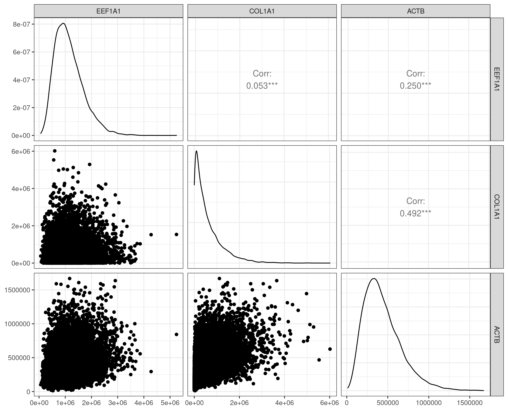

```{r LoadLib, echo = FALSE, eval = TRUE, message=FALSE, warning=FALSE, results = "hide"}
library(tidyverse)
library(rstanarm)
set.seed( 02102021 )
## devtools::install_github("ggobi/GGally")
## for ggpairs
library(GGally)
## xaringan::inf_mr('cmstats2020_talk.rmd')
```

<!-- 20-25 minutes -->

# 1 – Introduction

```{r ch010-myD, include=FALSE, cache = TRUE, eval=T}
d <- 1000
```

```{r ch010-processBRCA, echo=FALSE, eval=TRUE, results='none', cache=F}
brcaRDS <- paste0( "../data/brca", d, ".rds" )
if ( !file.exists( brcaRDS ) | !file.exists( '../data/examplePatients.txt' ) )  {
    brca0 <- TCGA2STAT::getTCGA(disease = "BRCA",
                            data.type = "RNASeq",
                            p = 6L)
    brca1 <- as.data.frame(t(brca0$dat))
    gene_median <- apply(brca1, 2, median)
    gene_median_order <- order(gene_median, decreasing = TRUE)
    brca  <- brca1[,head(gene_median_order, d)]
    writeLines( substring( row.names( brca ), first=1, last= 12 ), '../data/examplePatients.txt' ) 
    saveRDS(brca, brcaRDS)
}
brca <- readRDS(file = brcaRDS)
```

## Big Multivariate Data 

- It is critical to realistically simulate data when conducting Monte Carlo studies and methods.
- But measurements are often **correlated**, **non-normal**, and **high dimensional** in this era of big data.
- One example are *RNA-seq data* obtained through high-throughput biomedical experiments with Over  20,000 mRNA measurements from `r dim(brca)[1]` breast cancer patients (TCGA BRCA).

## Motivating example: RNA-seq data

- Simulating high-dimensional, non-normal, correlated data motivates this work --- in pursuit of modeling RNA-sequencing (RNA-seq) data [@Wang2009b; @Conesa2016b] derived from breast cancer patients. 
- The RNA-seq data-generating process involves counting how often a particular messenger RNA (mRNA) is expressed in a biological sample.
- RNA-seq platforms typically quantify the entire transcriptome in one experimental run, resulting in high-dimensional data.
- For human derived samples, this results in count data corresponding to over 20,000 genes (protein-coding genomic regions) or even over 77,000 isoforms when alternatively-spliced mRNA are counted.
- Importantly, due to inherent biological processes, gene expression data exhibits correlation --- co-expression --- across genes [@BE07; @Schissler2018]. 

## Intergeneic correlation

```{r ch010-realDataFig, cache=F, echo = FALSE, eval=TRUE, message=FALSE, warning=FALSE, fig.width= 8, fig.align='center', fig.cap="Marginal scatterplots, densities, and estimated pairwise Spearman's correlations for three example genes from Table 1. The data possess heavy-right tails, are discrete, and have non-trivial intergene correlations. Modeling these data motivate our simulation methodology."}
# lowerfun <- function(data,mapping){
#   ggplot(data = data, mapping = mapping)+
#     geom_point()+
#     scale_x_continuous(limits = c(-1.5,1.5))+
#     scale_y_continuous(limits = c(-1.5,1.5))
# }  
GGally::ggpairs( data = small,
                # lower = list( continuous = wrap(lowerfun)),
                upper = list(
                    continuous = wrap('cor', method = "spearman")
                ), 
                ) + theme_bw()
```


## Desired high-dimensional multivariate simulation properties

- Our goal is to simulate $N$ random vectors ${\bf Y}=(Y_1, \ldots, Y_d)^\top$ with **correlated** components.

Our proposed methodology should possess the following properties  
(adapted from @Nik13a):

* BP1: A wide range of dependences, allowing both positive and negative values, and, ideally, admitting the full range of possible values.
* BP2: Flexible dependence, meaning that the number of bivariate marginals can be equal to the number of dependence parameters.
* BP3: Flexible marginal modeling, generating heterogeneous data --- possibly from differing probability families.

Moreover, the simulation method must **scale** to high dimensions:

* SP1: Procedure must scale to high dimensions, computable in a reasonable amount time.
* SP2: Procedure must scale to high dimensions while maintaining accuracy.

## Our contribution

- We propose a Gaussian-copula random vector algorithm; an augmented NORmal To Anything (NORTA) @Cario1997 method. 
- We provide a high-performance and GPU-accelerated implementation in the `R` package [`bigsimr`](https://github.com/SchisslerGroup/bigsimr), along with related tools.
- An article motivating, describing, and applying the methods; in development.

# 2 - Background 

## Measures of dependency

- In multivariate analysis, an analyst must select a metric to quantify dependency.
- The most widely-known is the Pearson (product-moment) correlation coefficient that describes the linear association between two random variables $X$ and $Y$, and, it is given by

$$
\rho_P(X,Y) = \frac{E(XY) - E(X)E(Y)}{\left[ var(X)var(Y)\right]^{1/2}}.
$$

<!-- 
As @MB13 and @MK01 discuss, for a bivariate normal $(X,Y)$ random vector, the Pearson correlation completely describes the dependency between the components. 
For non-normal marginals with monotone correlation patterns, $\rho_P$ suffers some drawbacks and may mislead or fail to capture important relationships (@MK01).
Alternatively in these settings, analysts often prefer rank-based correlation measures to describe the degree of monotonic association.
-->

## Rank-based measures of dependency

Two nonparametric, rank-based measures common in practice are **Spearman's correlation** (denoted $\rho_S$) and **Kendall's $\tau$**. 

- Spearman's:

$$
\rho_S(X,Y) = 3 \left[ P\left[ (X_1 - X_2)(Y_1-Y_3) > 0 \right] - P\left[ (X_1 - X_2)(Y_1-Y_3) < 0 \right] \right],
$$

\noindent where $(X_1, Y_1) \overset{d}{=} (X,Y), X_2 \overset{d}{=} X, Y_3 \overset{d}{=} Y$ with $X_2$ and $Y_3$ are independent of one other and of $(X_1, Y_1)$. 

-  Kendall $\tau$, on the other hand, is the difference in probabilities of concordant and discordant pairs of observations $(X_i, Y_i)$ and $(X_j, Y_j)$.

Both $\tau$ and $\rho_S$ are **invariant to under monotone transformations** of the underlying random variates.

## Correspondence among Pearson, Spearman, $\tau$

- There is no closed form, general correspondence among the rank-based measures and the Pearson correlation coefficient, as the marginal distributions $F_i$ are intrinsic in their calculation.
- But for **bivariate normal vectors**, however, the correspondence is well-known for Kendall's $\tau$:

$$
\rho_{P} = sin \left( \tau \times \frac{\pi}{2} \right), 
$$ 

- and similarly for Spearman's $\rho$ [@K58],

$$
\rho_P = 2 \times sin \left( \rho_S \times \frac{\pi}{6} \right).
$$ 

## NORmal To Anything algorithm

- The well-known NORTA algorithm [@Cario1997] can be used simulate a random vector $\bf Y$ with variance-covariance matrix $\Sigma_{\bf Y}$.
- Specifically, the NORTA algorithm follows like this:

1. Simulate a random vector $\bf Z$ with $d$ **independent** and **identical** standard normal components.
2. Determine the input matrix $\Sigma_{\bf Z}$ that corresponds with the specified output $\Sigma_{\bf Y}$.
3. Produce a Cholesky factor $M$ of $\Sigma_{\bf Z}$ so that $M M^{\prime}=\Sigma_{\bf Z}$.
4. Set $X$ by $X \gets MZ$.
5. $\text{Return} \; Y \; \text{where} \; Y_i \gets F_{Y_i}^{-1}[\Phi(X_i)], \; i=1,2,...,d$.

- Exact Pearson solutions are possible but require computing $d \choose 2$ double integrals $EY_iY_j = \int \int y_i y_j f_{X|r}(F_i^{-1}(\Phi(z_i)), F_j^{-1}(\Phi(z_j))dy_idy_j$.
- But even when closed form solutions matching exactly can be impossible (*NORTA-defective* correlation matrices) and the probability of this increases with $d$ @GH02.

## Other `R` packages for simulating random vectors

Here are some other  R packages for multivariate simulation.

* `copula` Highly flexible copula specification [@Yan2007]
* `nortaRA` Implements exact Pearson matching (step 2 in NORTA) [@Chen2001] 
* `Genord` Simulated correlated discrete variables [@BF17]
* `mvnfast` High-performance multivariate normal simulator [@Fasiolo2016]

# 3 - Methodology/Algorithm

## Random vector generation via `bigsimr::rvec` {#rand-vec-gen}

1. Mapping step  
   i. Convert the target Spearman correlation matrix $R_S$ to the corresponding MVN Pearson correlation $R_X$.   
   or  
i$^\prime$. Convert the target Kendall $\tau$ matrix $R_K$ to the corresponding MVN Pearson correlation $R_X$.
2. Checking admissibility and, if needed, nearest correlation computation
    (i) Check that $R_X$ is a correlation matrix, a PSD matrix with 1's along the diagonal.   
	(ii) If $R_X$ is a correlation matrix, the input matrix is *admissible* in this scheme.  
	Otherwise,  
(ii$^\prime$) Replace $R_X$ with the nearest correlation matrix $R_X$, in the Frobenius norm.
3. NORTA step
	(i) Generate ${\bf X}=(X_1, \ldots, X_d) \sim N_d({\bf 0}, R_X)$.  
	(ii) Transform ${\bf X}$ to ${\bf U} = (U_1, \ldots,  U_d)$ viz $U_i=\Phi(X_i)$, $i=1, \ldots, d$.  
	(iii) Return ${\bf Y}  = (Y_1, \ldots,  Y_d)$, where $Y_i=F_i^{-1}(U_i)$, $i=1, \ldots, d$;  

# 4 - Monte carlo experiments and examples

## 4A - Bivariate studies

```{r ch040-biNegBin, echo = FALSE, eval = TRUE}
size <- 4
prob <- 3e-04
```

- Identical margin, bivariate simulation configurations to provide a low-dimensional evaluation:

| Simulation Reps ($B$) | Correlation Types | Identical-margin 2D distribution |
|-------------|:--------------:|----------------------:|
|$1000$ | Pearson ($\rho_P$) | ${ \bf Y} \sim MVN( \mu= 0 , \sigma = 1, \rho_i ), i=1,\ldots,100$ |
|$10,000$ | Spearman ($\rho_S$) | ${ \bf Y} \sim MVG( shape = 10, rate = 1, \rho_i ), i=1,\ldots,100$ |
| $100,000$| Kendall ($\tau$)| ${ \bf Y} \sim MVNB(p = `r prob`, r = 4,\rho_i), i=1,\ldots,100$ |

- For each of the unique 9 simulation configurations described above, we estimate the correlation bounds and vary the correlations along a sequence of 100 points evenly placed within the bounds, aiming to explore $\Omega$.
- Specifically, we set correlations $\{ \rho_1 = ( \hat{l} + \epsilon), \rho_2 = (\hat{l} + \epsilon) + \delta, \ldots, \rho_{100} = (\hat{u} - \epsilon) \}$, with $\hat{l}$ and $\hat{u}$ being the estimated lower and upper bounds, respectively, and increment value $\delta$.
- The adjustment factor, $\epsilon=0.01$, is introduced to handle numeric issues when the bound is specified exactly.

```{r ch040-combineBiSims, cache=F, echo=F}
## compare relative differences in MSE for each dependency, compared to Pearson
allDat <- NULL
dat <- readRDS("../results/biNorm_sims.rds") %>% select( margins, type, N, rho, rho_hat  ) 
allDat <- rbind( allDat, dat )
dat <- readRDS("../results/biGamma_sims.rds") %>% select( margins, type, N, rho, rho_hat  )
allDat <- rbind( allDat, dat )
dat <- readRDS("../results/biNB_sims.rds") %>% select( margins, type, N, rho, rho_hat  )
allDat <- rbind( allDat, dat )
allDat$margins <- factor(allDat$margins, levels = c( 'norm', 'gamma', 'nbinom'),
                         labels = c( 'MVN', 'MVG', 'MVNB' ) )
allDat$type <- factor(allDat$type, levels = c( 'pearson', 'spearman', 'kendall' ),
                      labels = c( 'Pearson', 'Spearman', 'Kendall' ) )
allDat$N <- factor(allDat$N, levels = c( 1000, 10000, 100000) )
```

---

```{r ch040-bPlot, cache=F, echo = FALSE, eval = TRUE, message=FALSE, warning=FALSE, fig.width = 7, fig.height = 6, fig.align='center'}
# https://www.datanovia.com/en/blog/how-to-change-ggplot-facet-labels/
# New facet label names
repsLabs <- paste0("B=", c("1,000", "10,000", "100,000") )
names(repsLabs) <- c(1000, 10000, 100000)
typeLabs <- c( 'Pearson', 'Spearman', 'Kendall' )
names(typeLabs) <- c( 'Pearson', 'Spearman', 'Kendall' )

# Set colors
## RColorBrewer::display.brewer.all()
numColors <- 4
numGroups <- length(levels(allDat$margins))
## myColors <- rev( RColorBrewer::brewer.pal(n = numColors, name = 'Greys')[ ((numColors - numGroups) + 1): numColors  ] )
myColors <- rev( RColorBrewer::brewer.pal(n = numColors, name = 'Blues')[ ((numColors - numGroups) + 1): numColors  ] )

allDat %>%
    ## ggplot(aes(x = rho, y = rho_hat, color = margins, shape = margins)) +
    ggplot(aes(x = rho, y = rho_hat, color = margins)) +
    ## ggplot(aes(rho, rho_hat)) +
    ## geom_point(alpha = 1, size = 2) +
    geom_point(size = 2) +
    ## scale_shape_manual(values=c(1, 2, 3))+
    ## scale_color_manual(values=c('#999999','#E69F00', '#56B4E9')) +
    scale_color_manual(values = myColors ) +
    geom_abline(slope = 1, linetype = 'dashed') +
    labs(x = "Specified Correlation", y = "Estimated Correlation") +
    ## facet_wrap(~ + N) + theme_bw()
    facet_wrap(~ type + N, labeller = labeller(N = repsLabs, type = typeLabs)) +
    theme_bw() +
    theme(legend.position = "bottom", legend.direction = "horizontal")

## allDat %>%
##     ggplot(aes(x = rho, y = rho_hat, color = type, shape = type)) +
##     ## ggplot(aes(rho, rho_hat)) +
##     geom_point(alpha = 0.75) +
##     geom_abline(slope = 1) +
##     labs(x = "Specified Correlation", y = "Estimated Correlation") + 
##     ## facet_wrap(~ + N) + theme_bw()
##     facet_wrap(~ margins + N) + theme_bw()
 
## ggsave('fig/plot-biNormPlot.pdf')
```

## 4A - Average absolute error in bivariate studies

```{r ch040-BiError, echo = FALSE, eval=TRUE, message=FALSE, warning=FALSE}
## tabMSE  <- allDat %>%
##    group_by( N, margins ) %>%
##    summarize( mse = mean( ( rho - rho_hat )^2 ) )
tabMAE  <- allDat %>%
    ## filter( N == 100000) %>%
    group_by( N, type, margins ) %>%
##     summarize( mse = mean( ( rho - rho_hat )^2 ) ) %>%
    summarize( MAE = mean( abs( rho - rho_hat )  ) )
## normMSE <- as.numeric( tabMSE[ tabMSE$margins == 'norm', 'mse' ] ) 
## ( tabMSE$mse - normMSE ) / normMSE
## ( tabMSE$mse - as.numeric( tabMSE[ tabMSE$margins == 'norm', 'mse' ]) )
## ( tabMSE$mse - as.numeric( tabMSE[ tabMSE$margins == 'norm', 'mse' ]) ) / tabMSE$mse

## AGS 12/22/20: Removing the latex formatting fixes the html render.
## But how to improve latex table formatting? Better to use the template
knitr::kable(tabMAE,
             ## format = 'latex',
             col.names = c("No. of random vectors",
                           "Correlation type",
                           "Distribution",
                           "Mean abs. error"),
             ## booktabs = TRUE,
             caption = 'Average abolute error in matching the target dependency across the entire range of possible correlations for each bivariate marginal.',
             ## linesep = c('', '',  '\\addlinespace')
)
```

## 4B - Simulating High-Dimensional RNA-seq data

First estimate the desired correlation matrix using the fast implementation provided by `bigsimr`:

```{r ch050-estRhoBRCA, echo=TRUE, eval=TRUE, cache=F}
## Estimate Spearman's correlation on the count data
type <- 'spearman'
R_S <- bigsimr::cor_fast(brca, method = type)
```

## 4B - Estimate the marginal parameters

- We use method of moments (MoM) to estimate the marginal parameters for the multivariate negative binomial model.
- The marginal distributions are from the same probability family (NB) yet are heterogeneous in terms of the parameters probability and size $(p_i, n_i)$ for $i,\ldots,d$.

```{r ch050-nbHelpers, echo=TRUE}
make_nbinom_alist <- function(sizes, probs) {
  lapply(1:length(sizes), function(i) {
    substitute(qnbinom(size = s, prob = p), 
               list(s = sizes[i], p = probs[i]))
  })
}
## make_nbinom_alist(c(20, 21, 22), c(0.3, 0.4, 0.5))
nbinom_mom <- function(x) {
  m <- mean(x)
  s <- sd(x)
  s2 <- s^2
  p <- m/s2
  r <- m^2 / (s2 - m)
  c(r, p)
}
```

## 4B - Estimate the marginal parameters

```{r ch050-estMargins, echo = TRUE, eval = TRUE, cache=F}
sizes <- apply( unname(as.matrix(brca)), 2, nbinom_mom )[1, ]
probs <- apply( unname(as.matrix(brca)), 2, nbinom_mom )[2, ]
```

- Notably, the marginal NB probabilities $\hat{p}_i's$ are small --- ranging in $[`r min(probs)` , `r max(probs)`]$.
- This gives rise to highly variable counts and, typically, less restriction on potential pairwise correlation pairs.
- Once the functions are defined/executed to complete marginal estimation, we specify targets and generate the desired random vectors using `rvec`.

## 4B - Simulate RNA-seq data via `bigsimr::rvec`

```{r ch050-runBRCA-echo, echo=TRUE, eval=FALSE, cache = FALSE}
sim_nbinom <- rvec(10000, R_X, nb_margins, ensure_PSD = FALSE, cores = cores) 
colnames(sim_nbinom) <- names(brca)
```

```{r ch050-runBRCA, echo=FALSE, results=FALSE, cache = FALSE}
brcaSimRDS <- paste0( "../results/brca", d, "sim.rds" )
if( !file.exists(brcaSimRDS) ) {
    set.seed(44)
    sim_nbinom <- rvec(10000, R_X, nb_margins, ensure_PSD = FALSE, cores = cores)
    saveRDS( sim_nbinom, brcaSimRDS )
}
sim_nbinom <- readRDS( brcaSimRDS )
```

## 4B -  Results for the three example genes 

```{r ch050-simDataFig, echo=F, fig.align='center', fig.cap='Simulated data for three selected high-expressing genes replicates the estimated data structure.', out.width='50%'}
## knitr::include_graphics("../fig/realDataFig.png")

```

## 4B - Results for all genes

<!-- 
Displayed are the aggregated results of our simulation by comparing the specified target parameter (horizontal axes) with the corresponding quantities estimated from the simulated data (vertical axes).
The evaluation shows that the simulated counts approximately match the target parameters and exhibit the full range of estimated correlation from the data.
Utilizing 15 CPU threads in a MacBook Pro carrying a 2.4 GHz 8-Core Intel Core i9 processor, the simulation completed just over of 2 minutes.
-->

```{r ch050-figBRCA, echo=F, fig.align='center', out.width='60%'}
knitr::include_graphics('../fig/ch050-figBRCA.png')
```

## 4C - Simulation-based joint probability calculations

- To conduct statistical inference a critical task is to evaluate the joint probability mass (or density) function:

$$
P( {\bf Y} = {\bf y} ), y_i \in \chi_i.
$$

- So we may estimate via:

$$
\hat{P}( {\bf Y} \geq {\bf y_0 } ) = \frac{1}{B} \sum_{b=1}^B I( {\bf Y^{(b) }} \geq {\bf y_0 } )
$$

- where ${\bf Y^{(b)} }$ is the $b^{th}$ simulated vector in a total of $B$ simulation replicates and $I ( )$ is the indicator function.

## 4C - Simulation-based joint probability calculations

- For example, we can estimate from our  simulated vectors the probability that all $`r d`$ genes are expressed (i.e., ${\bf y}_i \geq 1, \forall \; i$) :

```{r ch050-densityEvaluation, echo=TRUE, eval=TRUE, cache=F}
d <- ncol(sim_nbinom)
B <- nrow(sim_nbinom)
threshold <- rep( 1, d)
mean(apply( sim_nbinom,  1,
           function(X, y0=threshold) {
               all( X >= y0) }
           ))
```

## 4D - Scale up to high dimensional RNA-seq data

- Lastly, we provide computation times at increasing $d$ to assess scaling feasibility:

```{r, echo=F, out.width='80%', fig.align='center'}
knitr::include_graphics("../fig/cpu-gpu-times.png")
```

# 5 - Conclusions
	
## 5 - Concluding remarks

- Our scaleable simulation algorithm provides a flexible way to simulate high-dimensional *fake datasets*.
- `bigsimr` is on `Github`: [https://github.com/SchisslerGroup/bigsimr](https://github.com/SchisslerGroup/bigsimr).
- Use `devtools` to install.
- `bigsimr` uses `JAX` python libraries for GPU acceleration and other high
  performance algorithms.

### Pros

* An easy-to-use tool to produce multivariate data of dimension larger than any
  other existing tool.
* Flexible modeling providing highly hetereogenous specification of joint probability models.
* The R `bigsimr`package is a high-performance and GPU-accelerated implementation
  of algorithm and other fast correlation utilities.

### Cons
* Discrete margins can slightly disrupt the matching algorithm (due the probability of ties). 
* ~~exact Pearson matching is not supported.~~ EDIT: Pearson matching added via Hermite polynomial in `Julia` 

## Future Work

* Investigate *rescaling* the correlations to adjust for discrete margins.
* High-performance implementations, algorithms for Pearson matching.
* Implement high-dimensional covariance estimation algorithms.


## Gratefully acknowledge

- Heather Knudson (graphic design)
- Eric Li, MS
- Fred Harris, PhD

### Funding and grants

- Research reported in this publication was supported by MW-CTR-IN of the National Institutes of Health under award number NIH 1U54GM104944.
- Research & Innovation, UNR

## Ongoing project HD multilevel survival model 

* precision medicine of cancer 
* finding biomarkers from underrepresented patients 

```{r readFits, echo=F}
fit <- fit0group <- readRDS( '~/article_survHD/results/fitOLDDATA_group_0_hs_ms_4_4_02162021_2000.rds')
## summary(fit)
## print(fit, digits=2)
## ps_check(fit)
```

```{r psCheckFinalFit0group, echo=F, cache=T}
raceLevels <- c('white', gsub( 'race', '', names(coef(fit0group))[2:3]) )
nd <- data.frame( race= raceLevels )
ps <- posterior_survfit(fit0group,
                        newdata = nd,
                        times = 0,
                        extrapolate = TRUE, control = list(edist = 8000))
panel_labels  <- c( '1' = "white", '2' = "black or african american", '3'= "asian")
pps <- plot(ps) + facet_wrap( ~ id, labeller = labeller(id=panel_labels))
pps
```

## Ongoing projects 2

- Other simulation and PMF calculations (*T-Poisson* article under minor revisions)
- Bayesian modeling of high-resolution NFL data (Erick Luerken, PhD student)
- Bayesian multilevel modeling of the pyschometric function 
- Bayesian multilevel modeling of US Electoral College (Andrey Sarantsev, Richard Foote).
- Bayesian imputation of missing single-cell RNA-seq data.

</div>

<style>
slides > slide { overflow: scroll; }
slides > slide:not(.nobackground):before {
  background: none;
}
</style>

## References
